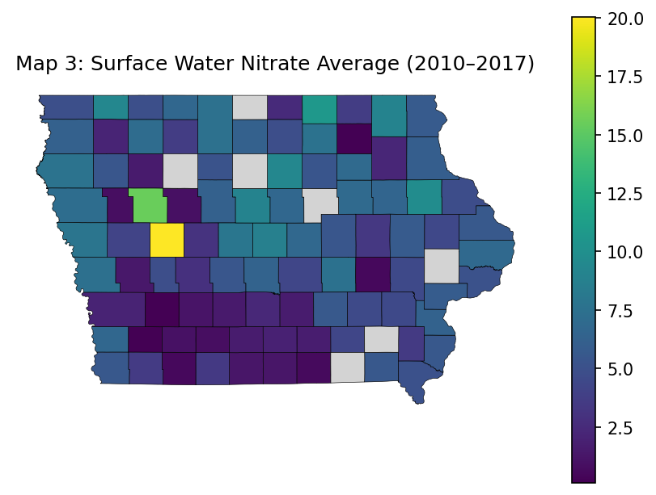
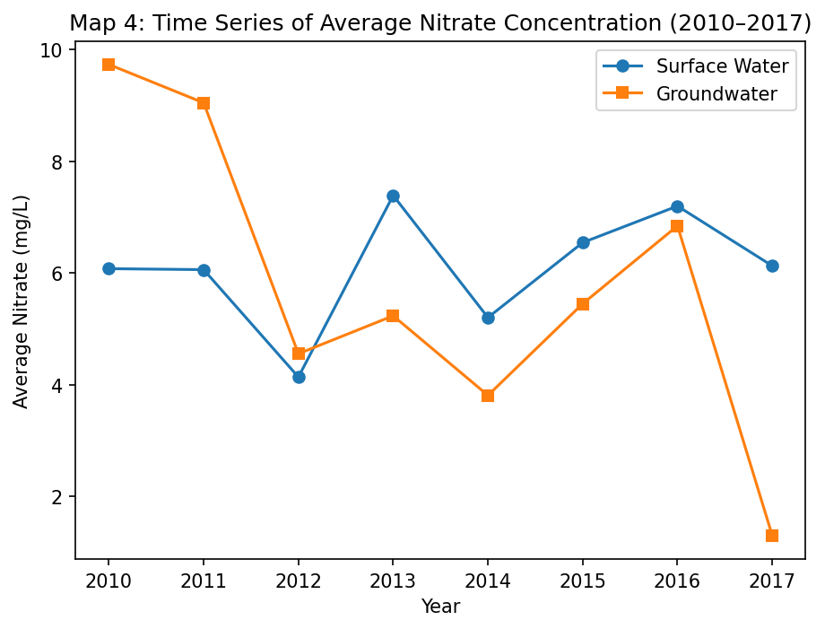
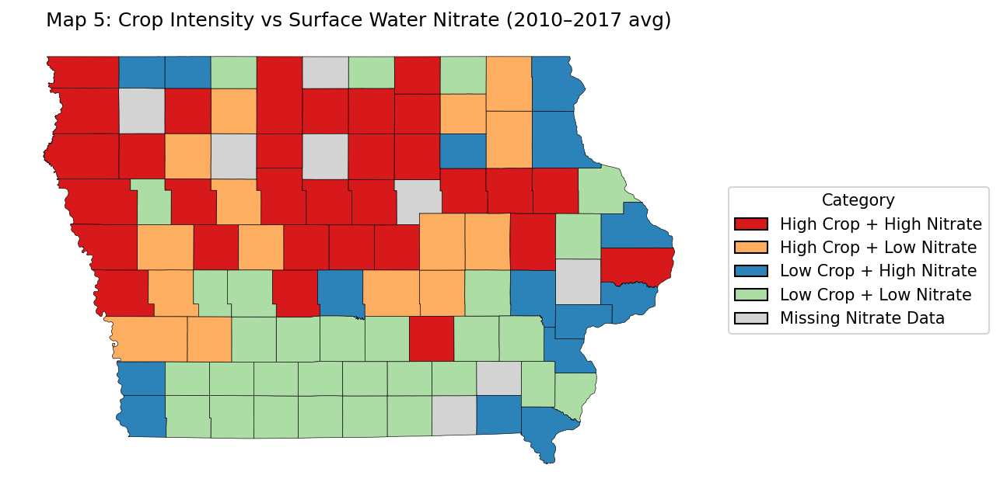
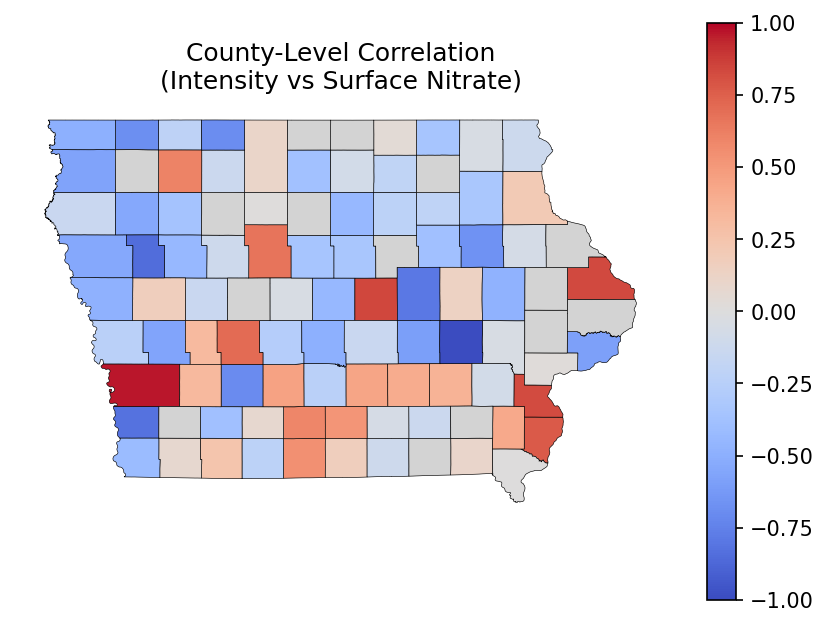
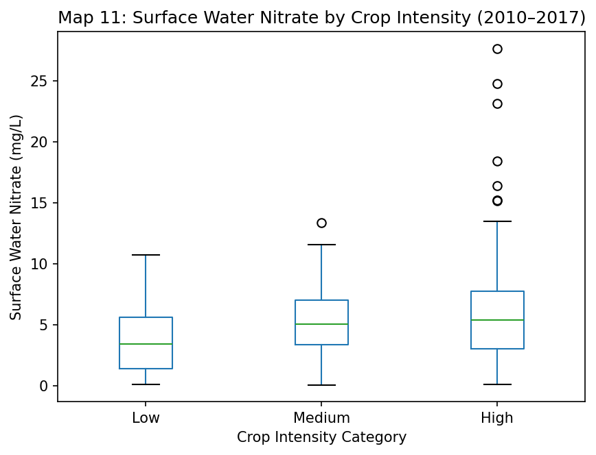

# Agricultural Intensity and Nitrate Contamination in Iowa (2010–2017)

A geospatial data analysis project investigating whether Iowa counties with higher agricultural intensity show elevated nitrate concentrations in surface water and groundwater.

---

## Research Question

> From 2010–2017, are Iowa counties with higher agricultural intensity associated with higher nitrate concentrations in surface water and groundwater?

## Key Findings

| Metric | Value |
|--------|-------|
| Pearson r — agricultural intensity vs. surface water nitrate | **0.332** |
| Pearson r — agricultural intensity vs. groundwater nitrate | **0.242** |
| Pearson r — corn acreage vs. surface water nitrate | **0.375** |
| Pearson r — soybean acreage vs. surface water nitrate | **0.230** |
| Counties with surface water nitrate data | 92 of 99 |
| Surface water nitrate peak year | 2013 (avg 7.39 mg/L) |
| Groundwater avg nitrate range | 1.3–9.7 mg/L across years |
| EPA drinking water standard (nitrate) | 10 mg/L |

- Counties with higher corn and soybean acreage show a moderate positive association with surface water nitrate (r = 0.33).
- Groundwater nitrate was highest in 2010–2011 (avg ~9.7 mg/L), approaching the EPA 10 mg/L limit in some counties.
- Surface and groundwater nitrate dynamics differ — surface water responds more rapidly to year-to-year variation while groundwater is more stable.
- The association is not uniform across Iowa; some counties with high agricultural intensity show low nitrate (likely due to soil type, drainage infrastructure, and precipitation differences).

---

## Visualizations

| Map | Description |
|-----|-------------|
| Map 0 | Crop-specific correlation with surface water nitrate (scatter) |
| Map 1 | Total crop acreage by county — 2012, 2014, 2016 + % change |
| Map 2 | Average corn and soybean concentration by county |
| Map 3 | Average surface water nitrate by county (2010–2017) |
| Map 4 | Time series — surface water vs. groundwater nitrate (2010–2017) |
| Map 5 | Bivariate map — high/low crop intensity × high/low nitrate |
| Map 6 | Groundwater exceedance frequency (> 10 mg/L EPA limit) |
| Map 7 | Surface water nitrate trend slope by county (linear regression) |
| Map 8 | Surface vs. groundwater nitrate scatter by county-year |
| Map 9 | County-level Pearson correlation — intensity vs. surface nitrate |
| Map 10 | Distribution of nitrate concentrations — surface vs. groundwater |
| Map 11 | Nitrate by crop intensity category (boxplot) |

All generated figures are saved to the `figures/` directory.

### Sample Visualizations

**Map 3 — Average Surface Water Nitrate by County (2010–2017)**


**Map 4 — Time Series: Surface Water vs. Groundwater Nitrate**


**Map 5 — Bivariate: Crop Intensity × Nitrate**


**Map 9 — County-Level Correlation: Agricultural Intensity vs. Surface Nitrate**


**Map 11 — Nitrate by Crop Intensity Category**


---

## Data Sources

| Dataset | Source | Included |
|---------|--------|----------|
| County crop acreage (corn, oats, soybeans) | [USDA NASS Quick Stats](https://quickstats.nass.usda.gov/) | ✅ `data/raw/corn_oats_soyabeans.csv` |
| Surface water nitrate measurements | [EPA Water Quality Portal](https://www.waterqualitydata.us/) | ⬇️ download required (133 MB) |
| Groundwater nitrate measurements | [EPA Water Quality Portal](https://www.waterqualitydata.us/) | ✅ `data/raw/groundwater_nitrate.csv` |
| US County boundaries (2024 TIGER/Line) | [US Census Bureau](https://www.census.gov/geographies/mapping-files/time-series/geo/tiger-line-file.html) | ⬇️ download required (127 MB) |

See [`data/README.md`](data/README.md) for exact download instructions.

---

## Setup

```bash
# 1. Clone the repo
git clone https://github.com/pavanmanjunath18/iowa-nitrate-analysis.git
cd iowa-nitrate-analysis

# 2. Install dependencies
pip install -r requirements.txt

# 3. Download the two large data files
# See data/README.md for step-by-step instructions

# 4. Run the notebook
jupyter notebook iowa_nitrate_analysis.ipynb
```

---

## Project Structure

```
iowa-nitrate-analysis/
├── iowa_nitrate_analysis.ipynb   # Main analysis notebook
├── requirements.txt
├── data/
│   ├── README.md                 # Download instructions for large files
│   ├── raw/
│   │   ├── corn_oats_soyabeans.csv
│   │   ├── groundwater_nitrate.csv
│   │   └── water_nitrate.csv     # download required
│   └── shapefiles/               # download required
└── figures/                      # Generated by notebook
    ├── map0_crop_nitrate_scatter.png
    ├── map1_total_acreage.png
    ├── ...
    └── map11_nitrate_by_intensity.png
```

---

## Limitations

- Correlation does not imply causation.
- Nitrate sampling is spatially uneven — 7 counties have no surface water data.
- Agricultural intensity is measured by planted acreage, not fertilizer application rates.
- Confounding factors (rainfall, soil type, drainage tile systems) are not controlled.

---

## References

- USGS (2010). *Nutrients in the Nation's streams and groundwater.* https://pubs.usgs.gov/fs/2010/3078/
- Iowa Nutrient Reduction Strategy (2013). https://www.nutrientstrategy.iastate.edu/
- eCFR 40 CFR § 141.62 — Nitrate MCL = 10 mg/L. https://www.ecfr.gov/current/title-40/chapter-I/subchapter-D/part-141/subpart-G/section-141.62
- Vedachalam, S. (2018). *Source Water Quality and the Cost of Nitrate Treatment in the Mississippi River Basin.*
- Water Quality Portal. https://www.waterqualitydata.us/

---

*Built with Python · Pandas · GeoPandas · Matplotlib · Jupyter*
